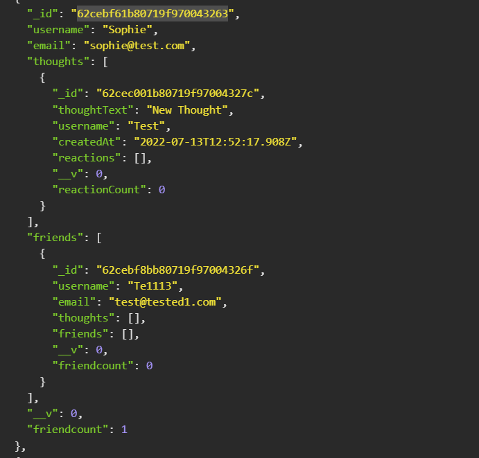

# Performing CRUD operations on a Social Media-style MongoDB   

In this project, I was approached to build the backend of a mock social media site. The client wanted it so that it would be easy and intuitive to perform  CRUD operations on the database that held Users, Thoughts and Reactions to those thoughts. They also wanted all of these schemas to be linked so that actions on one would affect the other when applicable e.g. When a thought was posted it would also populate on the relevant User collection or if a User was deleted all their thoughts wuld get deleted too. 

To achieve this, I took advantage of the mongoose DB package and all the functionality it offers, particularly the 'find', 'findOne', 'findOneAndUpdate' as well as the references to ensure that multiple collections could be targeted with just one http request.

## Table of Contents

[Installation](#installation)

[Usage](#usage)

[Contributing](#contributing)

[License](#license)

[Questions](#questions)

[Links](#links)

## Installation

To install this you will need to run: 'npm i' on the command line.

## Usage

To start you will need to run 'npm start' which will both seed the database and start the servers

## Contributing

To contribute to this, clone the repo locally and commit on a seperate branch.

## License

This application is covered under the following license: The Unlicence

## Links

I have created a walkthrough video that demonstrates the functionality of the application which can be viewed by [clicking here](https://drive.google.com/file/d/1Knq7uuc68J3UKfxpvLlWzNwNC3UIdwLo/view)

